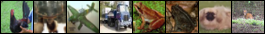
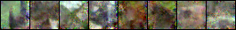
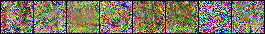
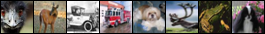
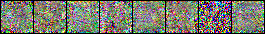

# Enhanced Security and Privacy via Fragmented Federated Learning
This repository contains PyTorch implementation of the paper: Enhanced Security and Privacy via Fragmented Federated Learning.

## Paper 

[Enhanced Security and Privacy via Fragmented Federated Learning]

## Content
The repository contains one main jupyter notebook: `Experiments.IPYNB` in each folder which can be used to re-produce the experiments reported in the paper. Each notebook contains clear instructions on how to run the experiments. 

**DISCLAIMER:** provided source code does **NOT** include the code of reconstruction attacks.
Usage and distribution of such code should be done separately at their authors' disclosure.
Reach out ([Inverting Gradients](https://github.com/JonasGeiping/invertinggradients)). We just provide a jupyter notebook that requires other packages from the mentioned source.

To simplify reproduction, we provide the experiments on [MNIST](http://yann.lecun.com/exdb/mnist/) and [CIFAR10](https://www.cs.toronto.edu/~kriz/cifar.html) datasets.
[IMDB](https://ai.stanford.edu/~amaas/data/sentiment/) requires manual downloads that are still not ready and that will be included soon.
## Dependencies

[Python 3.6](https://www.anaconda.com/download)

[PyTorch 1.6](https://pytorch.org/)

[TensorFlow 2](https://www.tensorflow.org/)

## Results

### Robustness to poisoning attacks

*Results of Gaussian noise attacks on the MNIST dataset (left), the CIFAR-10 (middle) and the IMDB (right).*   

*Results of label-flipping attacks on the MNIST dataset (left), the CIFAR-10 (middle) and the IMDB (right).*
  

### Defending reconstruction attacks

*Reconstruction of two input images from the gradients of two participants k and j.  Left: Two input images from k and j. Middle: Reconstruction from original gradients (FL). Right: Reconstruction from mixed gradients (FFL).*

  

*The first set of images shows the reconstruction of a batch of 8 input images from the gradients by the participant k and second set by the participant j. The first row of each set shows the input images. The second row shows the reconstruction from the original gradients of k and j (FL), respectively. The last row shows the reconstruction from the mixed gradients (FFL).*

## Citation 

## Funding
